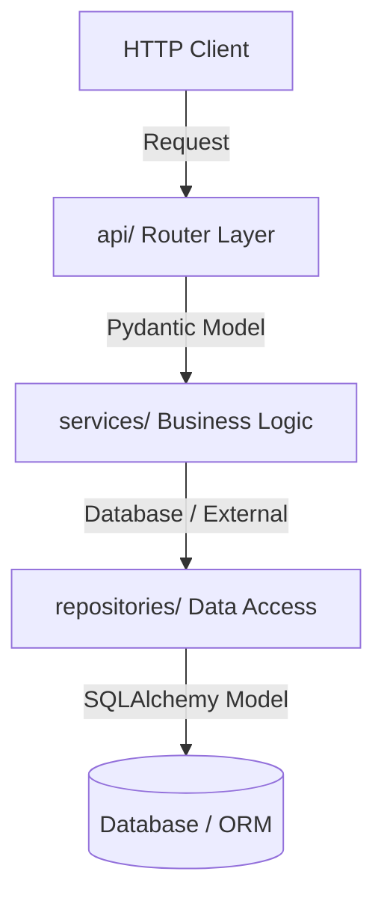

# FastAPI Base Template

A modern, highly structured, and scalable template for building API backends with FastAPI, Pydantic v2, and Python. This repository establishes a clean architectural separation of concerns suitable for microservices or production monoliths.

---

## 🚀 Getting Started

This project uses **`uv`** as the Python package and environment manager for extremely fast installs and execution.

### Prerequisites

Make sure you have `uv` installed. If you don't have it, install it using:
```bash
curl -sSf https://rye.astral.sh/get | bash
# or via pip
pip install uv
```

### Installation

Clone the repository and install all dependencies in a virtual environment:
```bash
# Sync dependencies and create/setup virtual environment (.venv)
uv sync
```

### Running the Application

To run the development server with hot-reloading enabled:
```bash
uv run uvicorn app.main:app --reload
```
Once started, the API documentation will be available at:
* **Swagger UI:** [http://127.0.0.1:8000/docs](http://127.0.0.1:8000/docs)
* **ReDoc:** [http://127.0.0.1:8000/redoc](http://127.0.0.1:8000/redoc)
* **Health Check Endpoint:** [http://127.0.0.1:8000/health](http://127.0.0.1:8000/health)

### Running Tests

Run the test suite using `pytest`:
```bash
uv run pytest
```

---

## 📁 Directory Structure

Below is an overview of the template's directory structure and the responsibility of each layer:

```text
.
├── app/                  # Main application package
│   ├── api/              # API router and versioned endpoint controllers (Thin Layer)
│   ├── core/             # Application configuration, environment variables, security
│   ├── db/               # Database setup, connection pool, session, and ORM models
│   ├── models/           # Pydantic schemas (data input validation & output serialization)
│   ├── repositories/     # Data access layer (SQLAlchemy/psycopg2 queries)
│   ├── services/         # Core business logic layer (independent of HTTP framework)
│   ├── utils/            # Stateless utilities and helper functions
│   └── main.py           # Application factory and entry point
├── test/                 # Test suite
│   └── api/              # API integration tests
├── pyproject.toml        # Project configuration and dependency declarations
└── docker-compose.yml    # Docker container definition (e.g. for PostgreSQL)
```

Each subdirectory in `app/` and `test/` contains its own dedicated `README.md` file explaining the rules and design patterns governing that layer.

---

## 🛠️ Architecture & Flow of Control

The template follows a **Layered Architecture (N-Tier)**:



1. **API Router Layer (`app/api/`)**: Thin controllers validating incoming HTTP requests via Pydantic and calling the Service layer.
2. **Service Layer (`app/services/`)**: The core engine containing business logic, integrations, or AI logic. Free from HTTP framework dependencies.
3. **Repository Layer (`app/repositories/`)**: Encapsulates data queries. Accepts/returns data models, keeping SQL or ORM constructs separate from business logic.
4. **Database Layer (`app/db/`)**: Holds the connection setups and actual database table mappings.

---

## ⚙️ Configuration & Environment

Configuration is managed using **Pydantic Settings**. Define variables in a `.env` file at the project root, and they will be validated and loaded automatically in `app/core/config.py`.